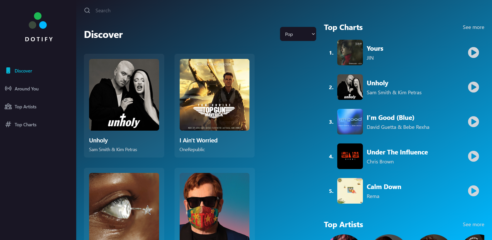

# Dotify - a music streaming app

A music streaming application based on spotify app desgn and rapid api.


## Screenshots




## Acknowledgements

 - [Rapid API](https://rapidapi.com/)
 - [Geo ipify](https://geo.ipify.org/)


## Demo

https://dotify-music.web.app/


## Tech Stack

React, Redux, TailwindCSS, Rapid API, 


## Environment Variables

To run this project, you will need to add the following environment variables to your .env file

`VITE_SHAZAM_CORE_RAPID_API_KEY`

`VITE_GEO_API_KEY`


## Run Locally

Clone the project

```bash
  git clone https://link-to-project
```

Go to the project directory

```bash
  cd my-project
```

Install dependencies

```bash
  npm install
```

Start the server

```bash
  npm run start
```


## 🚀 About Me
I'm Coffie Jason, a full stack developer skilled in React and Nodejs.
Reach out to me coffiejasoncj@gmail.com

